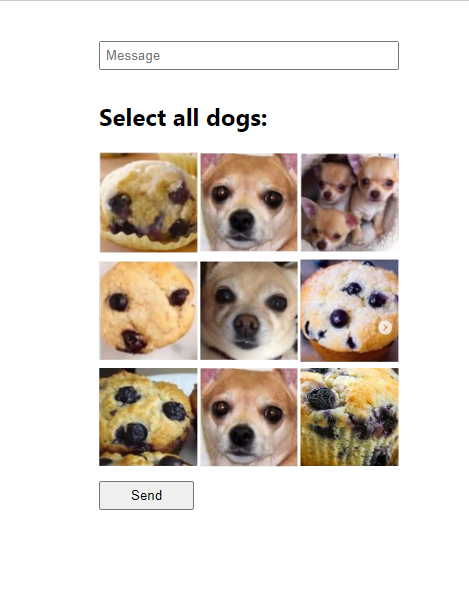
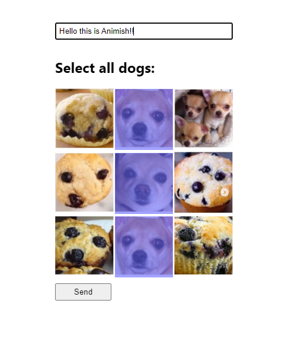

# Ani-Captcha

# This site is a robot detecter , it involves choosing the correct dog images from a set of random images . The message is sent only if the chosen set of dog images is correct .  To prevent a robot / person from reading the url path of image from memory i have encoded the url with Iron-Session .

# Screenshots

# Normal Image

# Selected Image(with message)
